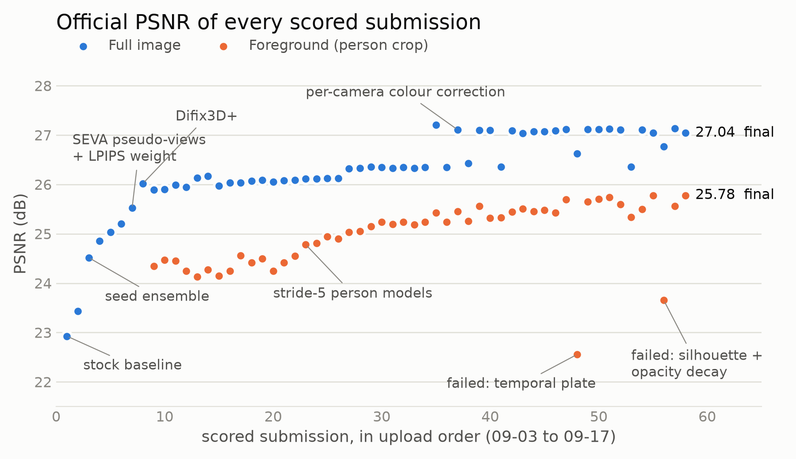
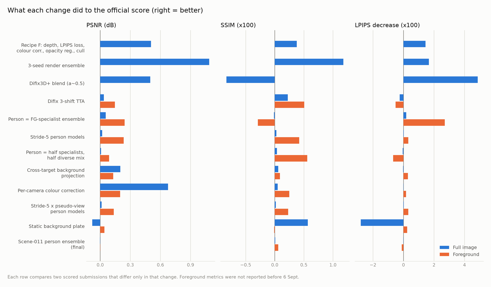
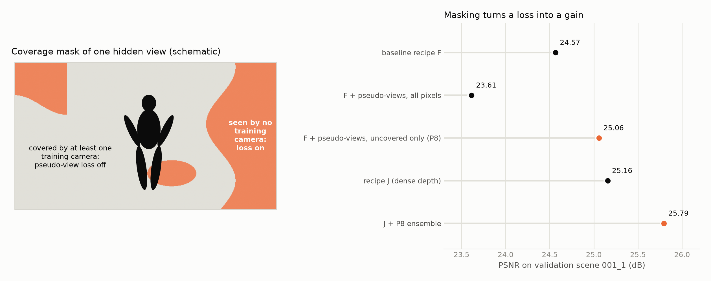
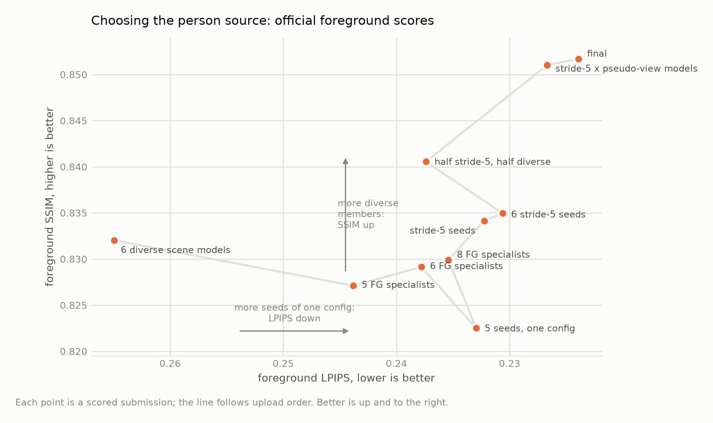
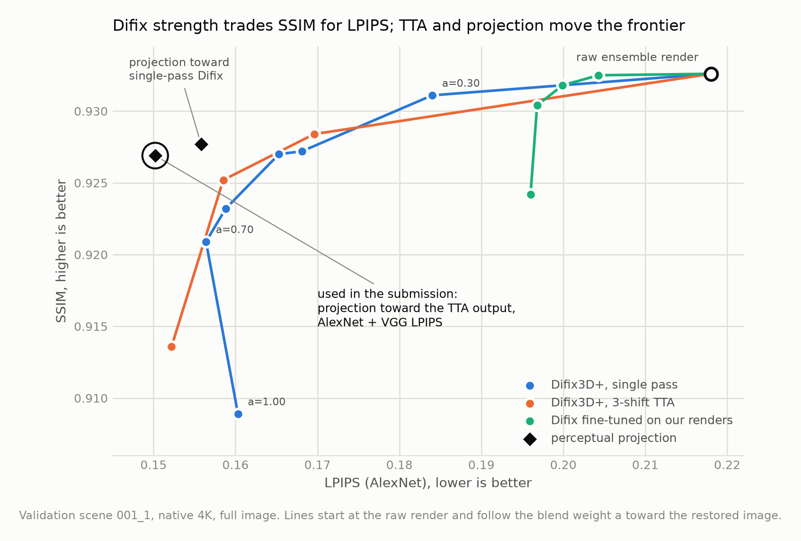
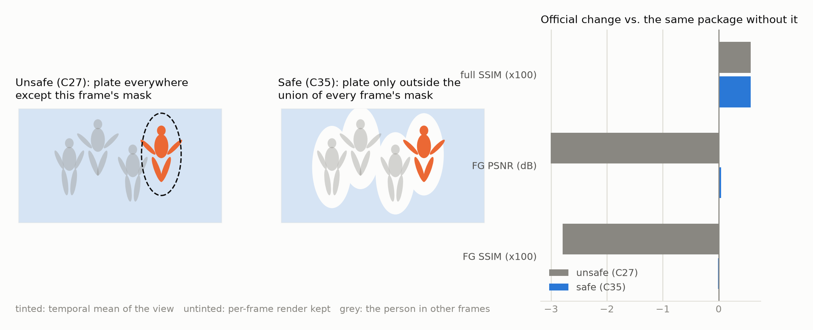
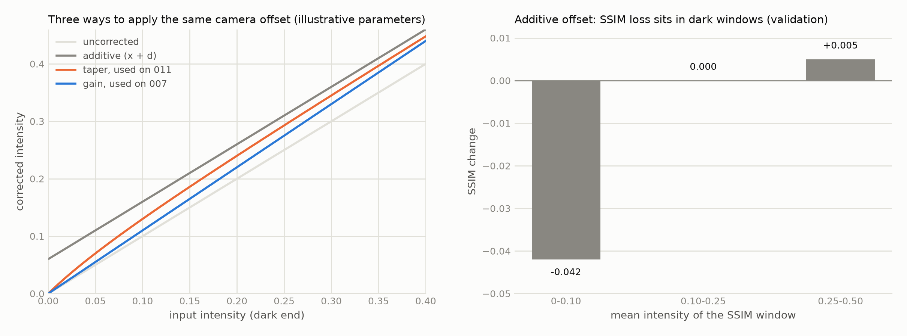
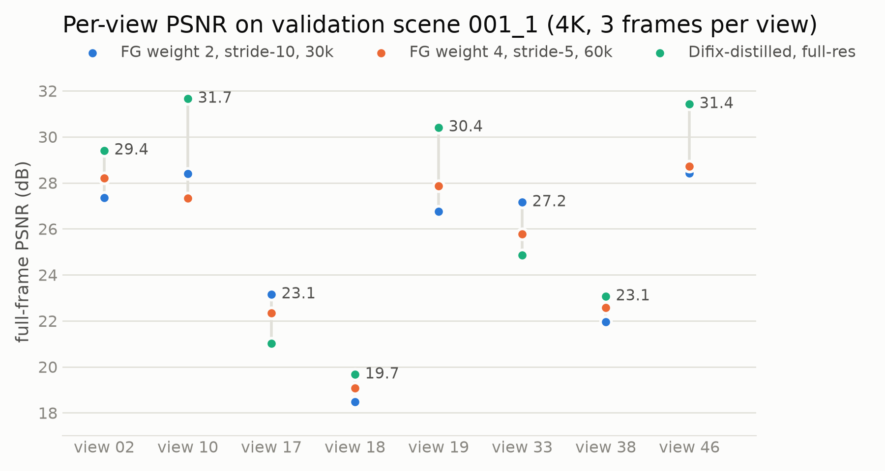

# SIGGRAPH Asia 2026 Volumetric Video Challenge: Sparse-View Track (3rd place)

Team **Doreen071** finished **3rd** in the Sparse-View Volumetric Video Reconstruction track of the
[2nd Volumetric Video Challenge @ SIGGRAPH Asia 2026](https://zju3dv.github.io/sigasia2026-vvc/), with a final
rank score of **3.333**. The organizing committee confirmed the result by email on 2026-09-27.

The task: each test scene is a person moving in a studio, filmed by a fixed camera rig. Six cameras are given
for training. We had to render 8 hidden cameras at native 4K (every 10th frame, 2,056 images across 5 scenes).
Submissions were ranked on PSNR, SSIM and LPIPS, computed twice: on the full image and on a crop around the
person. The final score is the mean of those six per-metric ranks.

Final submission (`C43_011b`), official evaluator:

| | PSNR | SSIM | LPIPS |
|---|---|---|---|
| Full image | 27.041 (rank 4) | 0.9287 (rank 2) | 0.2091 (rank 3) |
| Foreground | 25.779 (rank 4) | 0.8517 (rank 5) | 0.2239 (rank 2) |

Final standings:

| place | team | FULL ranks (P/S/L) | FG ranks (P/S/L) | score |
|---|---|---|---|---|
| 1 | shengqi | 1 / 4 / 1 | 1 / 2 / 1 | 1.667 |
| 2 | yunqigao | 2 / 1 / 2 | 3 / 1 / 5 | 2.333 |
| **3** | **Doreen071** | **4 / 2 / 3** | **4 / 5 / 2** | **3.333** |
| 4 | hyokong | 3 / 3 / 5 | 2 / 4 / 8 | 4.167 |
| 5 | recgen4d | 5 / 7 / 9 | 5 / 3 / 9 | 6.333 |

Starting from the provided FreeTimeGS++ baseline (22.93 dB), we raised full-image PSNR by 4.1 dB over about 60
scored submissions in 15 days.

<picture>
  <source media="(prefers-color-scheme: dark)" srcset="docs/figures/pipeline_dark.png">
  
</picture>

Each card lists the gain we measured for that stage, taken from two scored submissions that differ only in it.
Everything in the figures is drawn schematically: the dataset licence does not allow redistributing its images
(see [Dataset licence](#dataset-licence)).

## Results

<picture>
  <source media="(prefers-color-scheme: dark)" srcset="docs/figures/progress_dark.png">
  
</picture>

Every point is a real evaluator score (58 of our submissions; byte-identical re-uploads and a few whose scores
we did not record are left out). The table behind it, with what changed in each submission, is
[docs/data/submissions.csv](docs/data/submissions.csv). The scatter is not monotonic because we used the
evaluator to test ideas: several points are deliberate probes (for example without colour correction, to
isolate another change), and two are failures that we reverted.

<picture>
  <source media="(prefers-color-scheme: dark)" srcset="docs/figures/stage_gains_dark.png">
  
</picture>

The ranking is per metric, so a change that helps one metric can cost another. Difix bought 0.049 of LPIPS
for 0.008 of SSIM, and the static plate went the other way. Late in the challenge, which metric to trade
was decided by recomputing every team's rank for the candidate ([scripts/board_sim.py](scripts/board_sim.py)).

## Method

Half of the score is measured on a crop around the person, which covers about 6% of the pixels. We therefore
treat the person and the background as separate problems, each with its own models and post-processing, and
composite them at the end.

### 1. Per-scene 4D Gaussians

All models are [FreeTimeGS++](ftgspp/README.md) with additions that are off by default and switched on through
environment variables ([ftgspp/MODIFICATIONS.md](ftgspp/MODIFICATIONS.md)).

<picture>
  <source media="(prefers-color-scheme: dark)" srcset="docs/figures/pseudo_views_dark.png">
  
</picture>

**Pseudo-views, masked by coverage.** SEVA (Stable Virtual Camera) renders the hidden poses from the six
training views. Supervising on the whole generated image made the person ghost: all seven unmasked variants lost
to the baseline. Restricting the loss to pixels that no training camera sees
([scripts/seva/coverage_mask.py](scripts/seva/coverage_mask.py)) turned the loss into a gain. The masked model
also helps as an ensemble member and stayed in every later ensemble.

Other training changes that improved the official score:

* **Dense VGGT depth** (weight 0.1) on every training frame, on top of the sparse keyframe depth.
* **Person-weighted loss** (L1+SSIM on the DeepLabV3 person region, weight 4) with 60k iterations. At 30k
  iterations weight 4 was worse than weight 2; the longer schedule is what makes the higher weight pay off.
* **Keyframe stride 5 instead of 10** for the point-cloud initialisation: the only structural change that
  improved all six metrics at once on validation. Stride 3 was worse than stride 5 on the foreground metrics.
* **Capacity and resolution.** 4M Gaussians and full-resolution training help as ensemble members; 8M Gaussians
  overfit the six views and were worse everywhere.

### 2. Choosing the person source

<picture>
  <source media="(prefers-color-scheme: dark)" srcset="docs/figures/ensemble_plane_dark.png">
  
</picture>

Renders are averaged per pixel. On the official foreground scores, diverse members raised SSIM and more seeds of
one configuration lowered LPIPS, so the final person source mixes half "person specialists" (up to 15 models of
the recipe above) with half a diverse scene mix. Adding weaker members diluted the average: a 9-member ensemble
scored below the 6-member one on all six metrics.

### 3. Difix3D+ and perceptual projection

<picture>
  <source media="(prefers-color-scheme: dark)" srcset="docs/figures/difix_frontier_dark.png">
  
</picture>

`nvidia/difix_ref` restores each render, using the nearest training view of the same scene as reference.
Blending in more of its output lowers LPIPS and costs SSIM. Two things moved that frontier instead of sliding
along it:

* **Test-time augmentation.** Running Difix over three shifted tile grids and averaging removes seams and
  grid-dependent hallucination.
* **Perceptual projection.** Per image we optimise `LPIPS(x, Difix target) + 15 * (1 - SSIM(x, raw render))` for
  200 steps, taking perceptual detail from the restored image and structure from the reconstruction. Projecting
  toward the Difix output of a different, stronger ensemble (cross-target) fixed a full-image LPIPS regression
  that projecting toward its own Difix output could not.

Fine-tuning Difix on our own renders did not help: at matched SSIM the released weights were as good or better.

### 4. Static background plate

<picture>
  <source media="(prefers-color-scheme: dark)" srcset="docs/figures/static_plate_dark.png">
  
</picture>

The cameras are fixed and the room is static, so each view's background can be averaged over time to remove
per-frame render noise. The first version replaced everything outside the current frame's person mask and lost
3 dB of foreground PSNR on test. The final version
([scripts/temporal_bg_safe.py](scripts/temporal_bg_safe.py)) only replaces pixels the person occupies in no
frame at all, and keeps the full-image SSIM gain without touching the foreground.

### 5. Colour correction for hidden cameras

<picture>
  <source media="(prefers-color-scheme: dark)" srcset="docs/figures/colour_dark.png">
  
</picture>

The baseline learns a colour corrector for each training camera, and hidden cameras never get one. Two test
scenes share their camera rig with a public validation scene, so for those we apply a per-camera colour prior
fitted on the matching validation scene ([scripts/camcolor2.py](scripts/camcolor2.py)). A plain additive
offset gained 0.86 dB PSNR on test but lost SSIM: SSIM's luminance term is relative, so the same offset is a
large error in a dark window. Gain (007) and an offset tapered toward black (011) kept the PSNR gain without the
SSIM loss. See [Verification and disclosure](#verification-and-disclosure) for how the priors were fitted.

### Where the error remains

<picture>
  <source media="(prefers-color-scheme: dark)" srcset="docs/figures/per_view_dark.png">
  
</picture>

Views 17, 18 and 38 look into parts of the room that none of the six training cameras sees well. All three
models in the chart score 18.5-23.2 dB there, against 25-32 dB on the other views. A timestamp sweep on view 18
confirmed that the blur is spatial, not temporal: no render time makes it sharp. The data is in
[docs/data/val_001_1_per_view_psnr.csv](docs/data/val_001_1_per_view_psnr.csv).

### What did not work

Each of these was measured, on validation and in most cases also on the test evaluator. Details are in
[docs/EXPERIMENT_LOG.md](docs/EXPERIMENT_LOG.md).

| idea | result |
|---|---|
| Unmasked pseudo-view supervision (7 variants) | +2-4 dB on the worst view, -1.5-2 dB on four to six well-covered views |
| Culling or pruning the haze by view count or opacity | the haze cannot be separated from real geometry; every threshold lost PSNR |
| Inpainting or image-based warping of uncovered pixels | -1.4 to -1.7 dB |
| Diffuman4D human prior | person looks plausible but scores FG-PSNR 20.0 against 28.6 for our models |
| Temporal-width regulariser for the motion blur | worked mechanically, changed nothing: the blur is spatial |
| Fine-tuning Difix on our renders | dominated by the released weights at matched SSIM |
| GeoQuery (post-Difix restorer) | better PSNR/SSIM on one rig, worse LPIPS; net rank loss |
| Second round of Difix distillation | worse than the first round |
| Projection on the person region | all six metrics worse on test |
| Silhouette loss + visibility-aware opacity decay | FG-PSNR -2.1 dB on test (`C38`) |
| Sharpening, lower JPEG quality | traded SSIM or LPIPS rank away |

## Verification and disclosure

* **Inputs.** Each test scene is reconstructed from its own six training views only. SEVA, Difix3D+, VGGT and
  DeepLabV3 are external pretrained models; their inputs are the scene's own training views and our renders.
  Person masks are computed on our renders, never on ground truth.
* **Validation data.** The public validation scenes 001_1 and 012_0 (with ground truth) were used to tune
  hyperparameters, and to fit the per-camera colour priors in
  [scripts/priors/](scripts/priors/) (`cc2_001_1.json`, `cc2_012_0.json`). Those priors are applied to test
  scenes 007 and 011, which share the camera rig of 001_1 and 012_0. No validation image enters any
  reconstruction or any submitted file.
* **Test feedback.** The evaluator returns per-scene scores. We used them for model selection: several
  submissions are exact per-scene splices of earlier scored packages ([scripts/zip_splice.py](scripts/zip_splice.py)).
  Because the overall score is a view-weighted mean of the per-scene scores, a splice's score can be computed in
  advance, and the evaluator confirmed it.
* **Final submission.** `C43_011b` is the `C35` package (person ensemble, projected background, static plate,
  colour correction) with scene 011 rebuilt from a 15-member person ensemble for that scene.

## Reproducibility

This repository contains code, configuration and results only. Checkpoints and renders (about 1 TB) are not
included, and neither is the dataset (see below). Rebuilding the final submission means retraining on the
order of a hundred per-scene models, each taking one to a few GPU-hours. Most of the work ran on NCHC Nano4
nodes with 8 x H200.

The scripts are the ones we ran, not a cleaned-up release. They contain absolute paths from our cluster.
When reading them:

| path in scripts | in this repository |
|---|---|
| `/work/doreen071/vvc/work/` (`$W`) | [scripts/](scripts/) |
| `/work/doreen071/vvc/work/slurm/` | [scripts/slurm/](scripts/slurm/) |
| `/work/doreen071/vvc/repo/baseline_code/` | [ftgspp/](ftgspp/) |
| `$V/data/<scene>`, `$V/runs/`, `$V/submissions/` | dataset, checkpoints and renders, not included |

Training is non-deterministic (gsplat rasterisation, Difix tiling), so a rebuild matches our numbers in
distribution, not bit for bit.

## What is here

```
ftgspp/                 FreeTimeGS++ baseline with our additions (research licence, see ftgspp/LICENSE)
  MODIFICATIONS.md      every change, and exact patches for the files whose originals were kept
  patches/
scripts/                everything we ran (about 150 scripts), flat, as used during the challenge
  slurm/                SLURM jobs; specs/ holds one line per model: name, scene, env vars, Hydra overrides
  seva/                 SEVA pseudo-view generation, coverage masks, export to the training loader
  priors/               per-camera colour priors fitted on the validation scenes
docs/
  figures/              README figures, light and dark (no dataset images)
  make_figures.py       progress and per-view charts, and data/submissions.csv
  make_pipeline.py      pipeline overview
  make_analysis.py      stage gains, Difix frontier, person source, pseudo-views, static plate, colour
  data/                 submissions.csv (every scored submission), per-view validation PSNR
  EXPERIMENT_LOG.md     the lab notebook, chronological, English and Traditional Chinese
  make_qualitative.py   builds comparison images into docs/qualitative/ (not committed)
```

## The pipeline, step by step

Paths below follow the repository layout. Each step lists the script that implements it and one real
invocation.

1. **Point clouds, stride 5.** RoMa matches between training cameras every 5th frame:
   `python -m ftgspp.run data=siga_<scene> pipeline.stages=[points] init.keyframe_stride=5 init.points_path=<runs>/points_stride5`
   ([scripts/slurm/points5.sbatch](scripts/slurm/points5.sbatch)).
2. **Dense depth.** `python scripts/vggt_depth.py <scene_dir> <depth_dir>` (VGGT on the six views jointly,
   scaled to the calibrated camera centres).
3. **Pseudo-views.** [scripts/seva/](scripts/seva/): `make_scene.py` builds a SEVA scene per frame, then SEVA
   renders the hidden poses; `coverage_mask.py` marks pixels a training camera already sees; `export_pseudo.py`
   writes the `index.json` the training loader reads.
4. **Train.** One line per model in [scripts/slurm/specs/](scripts/slurm/specs/), for example
   `wave22_s5pseudo.txt`:
   `S5PS 004_1_seq0 FTGSPP_FG_WEIGHT=4.0 FTGSPP_POINTS_DIR=.../points_stride5 data.scale=1.0 train.iterations=60000 init.keyframe_stride=5 FTGSPP_PSEUDO_DIR=... FTGSPP_PSEUDO_W=0.15 FTGSPP_PSEUDO_LPIPS=0.03 FTGSPP_PSEUDO_START=8000`,
   launched by [scripts/slurm/train_spread_env_long.sbatch](scripts/slurm/train_spread_env_long.sbatch), which
   also sets the common recipe (`FTGSPP_LPIPS_W=0.3 FTGSPP_DEPTH_W=0.2 FTGSPP_REG_OPACITY=0.05 FTGSPP_DENSE_W=0.1`,
   colour correction and LPIPS loss on).
5. **Render the hidden cameras.**
   `python scripts/render_hidden.py <run_dir> <scene_dir> <out> --cull_near_frac 1.1 --cull_min_views 4`.
6. **Ensemble.** `python scripts/weighted_ensemble.py <dst> <tree1>:<w1> <tree2>:<w2> ...`.
7. **Difix3D+ with TTA.** `python scripts/difix_submission_h200.py <src> <dst> [--shift 320,288]` for three
   shifts, then `python scripts/tta_average.py <dst> <shift0> <shift1> <shift2>`.
8. **Background projection.**
   `python scripts/proj_multi.py tree <raw> <difix_target> <dst> --nets alex:1,vgg:0.5 --lam 15 --steps 200`.
9. **Static plate.** `python scripts/temporal_bg_safe.py <background> <person_source> <dst> --case <scene>`.
10. **Composite.** `python scripts/composite2.py tree <raw> <person_tta> 0.85 <background> 1.0 <dst> --feather 101`.
11. **Colour.** `python scripts/camcolor2.py apply <package.zip> <dst> 011_0_seq0 scripts/priors/cc2_012_0.json taper 1.2 --tau 0.10`
    (and `gain 1.0` with `cc2_001_1.json` for 007).
12. **Package.** `python scripts/pack_submission.py <out.zip> <render_root>`; optionally
    `python scripts/zip_splice.py <out.zip> <scene>=<scored.zip> ...` to combine scored packages per scene.

A full chain from ensemble to package, as submitted, is
[scripts/slurm/c22_nb3new.sbatch](scripts/slurm/c22_nb3new.sbatch), followed by
[c33_combo.sbatch](scripts/slurm/c33_combo.sbatch) and [c43_011boost.sbatch](scripts/slurm/c43_011boost.sbatch).

Scoring tools: [scripts/fg_eval_official.py](scripts/fg_eval_official.py) reproduces the foreground protocol
on validation dumps; [scripts/board_sim.py](scripts/board_sim.py) recomputes every team's rank for a candidate,
because a change in our metrics also changes other teams' ranks. The scripts that talk to the challenge portal
read the token from the `VVC_TOKEN` environment variable.

## Environment

* FreeTimeGS++: Python 3.12, PyTorch 2.5.1 + CUDA 12.1, `gsplat==1.5.3`; see [ftgspp/README.md](ftgspp/README.md)
  (`bash ftgspp/scripts/install_env.sh`). On H200 we used CUDA 12.6 and `TORCH_CUDA_ARCH_LIST=9.0`.
* Difix3D+ (weights `nvidia/difix_ref` on Hugging Face), installed with
  [scripts/setup_difix.sh](scripts/setup_difix.sh).
* Stable Virtual Camera (SEVA), VGGT, torchvision DeepLabV3, `lpips`, OpenCV.

## Dataset licence

The challenge data may not be redistributed without Zhejiang University's written permission, and that
includes derived data. Renders of the test and validation scenes are derived data, so this repository contains
no images from the dataset and no renders. The comparison figures can be rebuilt locally with
`python docs/make_qualitative.py <validation_dump> <unpacked_submission>`; `.gitignore` keeps
`docs/qualitative/` out of version control.

## Licence

Our own code (`scripts/`, `docs/`) is released under the MIT licence ([LICENSE](LICENSE)).
`ftgspp/` is a modified copy of FreeTimeGS++ and stays under its own non-commercial research and educational
licence ([ftgspp/LICENSE](ftgspp/LICENSE)); see [ftgspp/THIRD_PARTY.md](ftgspp/THIRD_PARTY.md) for its
dependencies. Difix3D+, SEVA and VGGT have their own licences.

## Acknowledgements

Thanks to the organizers of the Volumetric Video Challenge at SIGGRAPH Asia 2026 (ZJU3DV), to the FreeTimeGS
and FreeTimeGS++ authors (SNU VGI Lab, ETRI) for the baseline, and to the authors of Difix3D+, Stable Virtual
Camera, VGGT and RoMa. Compute was provided by the National Center for High-performance Computing (NCHC),
Taiwan.
